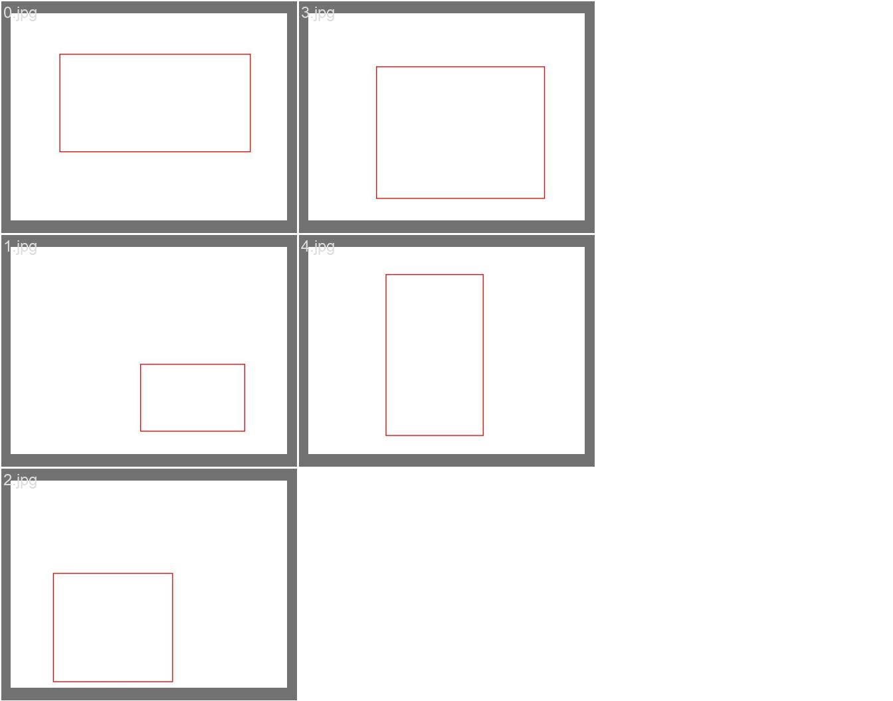

# 🍎 YOLOv5 Buah: Bandingkan Labeling Per Objek vs Per Grup

Eksperimen untuk mengevaluasi pengaruh metode pelabelan terhadap performa deteksi objek buah menggunakan YOLOv5. Proyek ini membandingkan dua pendekatan labeling:
- **Per Objek**: Setiap buah diberi bounding box terpisah.
- **Per Grup**: Satu bounding box mewakili sekelompok buah.

## 🧠 Tujuan Proyek
- Mengetahui dampak metode pelabelan terhadap akurasi model deteksi objek.
- Membandingkan mAP, presisi, recall, dan kecepatan inferensi dari dua model berbeda.
- Memberikan insight untuk kasus penggunaan dunia nyata seperti kasir otomatis atau smart shelf.

## 🧰 Teknologi
- Python 3.8+
- [YOLOv5](https://github.com/ultralytics/yolov5)
- PyTorch
- OpenCV
- Matplotlib (untuk evaluasi)

## 📁 Struktur Proyek
```markdown
YOLOv5-Fruit-Label-Comparison/
├── datasets/
│ ├── per_object/
│ └── per_group/
├── runs/
│ ├── train
│ └── detect/
├── train_per_group.yaml
├── train_per_object.yaml
├── train_per_group.py
├── train_per_object.py
├── convert_result.py
├── compaire_result.py
├── evaluate.py
├── run_detect.py
└── requirements.txt
```
## 🖼️ Contoh Perbedaan Labeling

### 🔹 Per Objek


### 🔸 Per Grup


## 🏃‍♂️ Cara Menjalankan

### 1. Clone Repo & Install Dependensi
```bash
git clone https://github.com/username/YOLOv5-Fruit-Label-Comparison.git
cd YOLOv5-Fruit-Label-Comparison
pip install -r requirements.txt
```
2. Training Model
```bash
# Per objek
python train.py --data train_object.yaml --weights yolov5s.pt --name object_model
# Per grup
python train.py --data train_group.yaml --weights yolov5s.pt --name group_model
```
3. Evaluasi Performa
```bash
python evaluate.py
```
4. Deteksi Buah
```bash
python detect.py --weights runs/train/object_model/weights/best.pt --source data/test.jpg
```
## 📊 Hasil Evaluasi
```markdown
| Model         | mAP50 | mAP50-95 | Precision | Recall |
|--------------|-------|----------|-----------|--------|
| Per Objek    | 0.025  | 0.004     | 0.018    | 0.111   |
| Per Grup     | 0.002  | 0.000     | 0.002    | 0.250   |
```

## 📌 Catatan: Per objek menghasilkan akurasi lebih tinggi, namun butuh lebih banyak waktu labeling.

## 📦 Dataset
Dummy dataset dibuat dengan Python dan tersedia di folder datasets/. Format mengikuti standar YOLOv5:

```bash
images/train/*.jpg
labels/train/*.txt
```
## 🤖 Penggunaan di Dunia Nyata
-Kasir Otomatis
-Estimasi Stok Rak Buah
-Inventory Visual
-Deteksi Objek dengan Kamera CCTV

## 🧑‍💻 Kontributor
rzzky18

## 📜 Lisensi
Proyek ini dilisensikan di bawah Apache 2.0.
